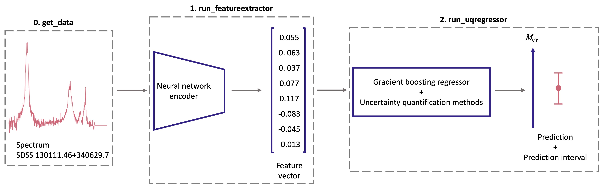

# Uncertainty Quantification of the Black Hole Mass Estimation

Predicting virial black hole masses using neural network model and quantifying their uncertainties.

This repository is to accompany the paper [Uncertainty Quantification of the Virial Black Hole Mass with Conformal Prediction](https://doi.org/10.1093/mnras/stad2080). 

## Setup and Requirement
```
git clone https://github.com/yongsukyee/uncertain_blackholemass.git && cd uncertain_blackholemass
pip install -r requirement.txt
```

## Pipeline



0. <details><summary>Get data</summary>
   
   - Setup configs:
     - `config/config.yaml`: Main config file
     - `config/config_getdata.yaml`: Additional configs to specify the data directory
   - To run: `$ python get_data.py`
   - See [Dataset](#dataset) on the catalogue and data used.
   </details>

1. <details><summary>Feature extractor using fully-connected neural network model</summary>
   
   - Setup configs: `config/config.yaml`
   - To run: `$ python run_featureextractor.py`
   - Generated output files:
     - `datasplitidx.pkl`: dict of data split indices {'train' train_idx, 'test': test_idx}
     - `yscaler.pkl`: sklearn.preprocessing scaler
     - `model.pth`: Trained PyTorch model
     - `loss.pkl`: DataFrame of 'train' and 'test' losses
     - `features.pkl`: DataFrame of features, 'objid', 'label', 'scaled_label', 'output'
   </details>
2. <details><summary>Uncertainty quantification for regression using MAPIE</summary>
   
   - Setup configs:
     - `config/config.yaml`: Main config file
     - `config/config_runuqregressor.yaml`: Additional configs to select saved log directory from `run_featureextractor.py`
   - To run: `$ python run_uqregressor.py`
   - Generated output files:
     - `estimator_optim.pkl`: Optimized GradientBoostingRegressor model for normal regression
     - `estimatorq_optim.pkl`: Optimized GradientBoostingRegressor model for quantile regression
     - `mapieuq_<STRATEGY>.pkl`: Fitted MapieRegressor for specified strategy
     - `mapieuq_pred.pkl`: y_pred, y_pis, sorted {'target', 'pred', 'lower', 'upper', 'pierr_metric'}
     - `mapieuq_picp_alpha.pkl`: DataFrame of prediction interval coverage probability (PICP) for different uncertainty quantification methods with alpha as index
     - `mapieuq_mpiw_alpha.pkl`: DataFrame of mean prediction interval width (MPIW) for different uncertainty quantification methods with alpha as index
   </details>

## Dataset
Dataset from Sloan Digital Sky Survey (SDSS) Data Release 16 quasar properties are publicly available for:
- Catalogue: http://quasar.astro.illinois.edu/paper_data/DR16Q/
- Spectra: http://quasar.astro.illinois.edu/paper_data/DR16Q/fits/

## Example Exploratory Notebooks
- `notebooks/inspectdata.ipynb`: Inspect data from SDSS
- `notebooks/featureextraction.ipynb`: Examine outputs of feature extraction
- `notebooks/uncertaintyquantification.ipynb`: Analyse various uncertainty quantification methods for the black hole mass estimation

## Reproducible Results
The `reproducible_output/` directory contains the generated logs and output files that are used for the analysis in our paper. For a list of output files, see [Pipeline](#pipeline).

## Citation
If you find this repository useful, please cite the paper:
```
@article{yong2023uqmbh,
    author = {Yong, Suk Yee and Ong, Cheng Soon},
    title = "{Uncertainty quantification of the virial black hole mass with conformal prediction}",
    journal = {Monthly Notices of the Royal Astronomical Society},
    volume = {524},
    number = {2},
    pages = {3116-3129},
    year = {2023},
    month = {07},
    issn = {0035-8711},
    doi = {10.1093/mnras/stad2080},
    url = {https://doi.org/10.1093/mnras/stad2080},
    eprint = {https://academic.oup.com/mnras/article-pdf/524/2/3116/50937641/stad2080.pdf},
}
```

## References and Resources
- Taquet, Vianney, V. Blot, Thomas Morzadec, Louis Lacombe and Nicolas J.-B. Brunel. “MAPIE: an open-source library for distribution-free uncertainty quantification.” ArXiv abs/2207.12274 (2022). \[[Paper](https://arxiv.org/abs/2207.12274) | [Code](https://github.com/scikit-learn-contrib/MAPIE)\]
- Romano, Yaniv, Evan Patterson and Emmanuel J. Candès. “Conformalized Quantile Regression.” Neural Information Processing Systems (2019). \[[Paper](https://arxiv.org/abs/1905.03222) | [Code](https://github.com/yromano/cqr)\]
- Angelopoulos, Anastasios Nikolas and Stephen Bates. “A Gentle Introduction to Conformal Prediction and Distribution-Free Uncertainty Quantification.” ArXiv abs/2107.07511 (2021). \[[Paper](https://arxiv.org/abs/2107.07511) | [Code](https://github.com/aangelopoulos/conformal-prediction)\]
